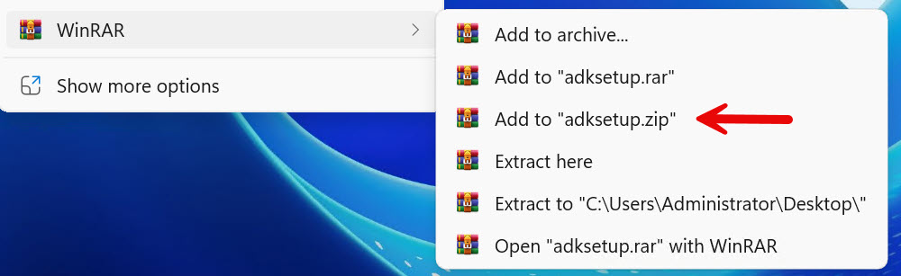

# MsixShellExtensions

Two C++ DLLs that add context menu entries to Windows Explorer for MSIX-packaged applications.

## Background

The starting point was WinRAR as an MSIX package. WinRAR ships its own shell extension (`RarExt.dll`),
but it silently stops working inside an MSIX container — the process that normally hosts it has no
access to the package's virtual registry, so clicking a menu entry does nothing.

The first solution was `MsixContextMenuHandler` — a replacement DLL that reads its configuration
from a JSON file and launches the application without touching the registry. This works, but entries
land under "Show more options" (the secondary flyout), not in the primary Windows 11 context menu.

To get entries into the **primary context menu** (directly visible, no extra click), a completely
different COM interface is required. `MsixModernContextMenuHandler` implements that interface
(`IExplorerCommand`) and was built as a second, standalone DLL. Both DLLs share a similar JSON
config format, but they are separate binaries with separate config files — the modern handler
has a few additional fields that the classic one does not use.



## The two DLLs

| | [MsixContextMenuHandler](MsixContextMenuHandler/) | [MsixModernContextMenuHandler](MsixModernContextMenuHandler/) |
|---|---|---|
| Where entries appear | "Show more options" (secondary flyout) | Primary menu, top section, directly visible |
| Requires MSIX to work | No — also works as a plain Win32 registration | Yes — the modern top section ignores Win32 registry entries for MSIX apps |
| Config file | `MsixContextMenuHandler.json` | `MsixModernContextMenuHandler.json` |
| Bitmap icons | Yes | No (icon path only, Explorer renders it) |
| Minimum OS | Windows 11 21H2 (Build 22000) | Windows 11 21H2 (Build 22000) |

## Testing without MSIX

Both projects include `Test\Install-*.ps1` and `Test\Uninstall-*.ps1` scripts.

**MsixContextMenuHandler**: registers the DLL in HKLM and entries appear in "Show more options".
Works fine for verifying JSON parsing, menu construction, and command invocation.

**MsixModernContextMenuHandler**: with admin rights (HKLM), the script registers an
`ExplorerCommandHandler` entry — this is the same mechanism used by Win32 applications like
Notepad++, and entries **do** appear in the primary modern context menu for testing purposes.
Inside an MSIX package the registry path is ignored; there the MSIX manifest is required.

> **Important for MSIX deployment**: the modern top section only loads `IExplorerCommand`
> handlers that are registered via the MSIX manifest (`desktop4:FileExplorerContextMenus`).
> Plain registry entries (even in HKLM) are ignored for MSIX-packaged applications.
> See the [MsixModernContextMenuHandler README](MsixModernContextMenuHandler/README.md) for
> the required manifest snippet.

## Building

Requirements: Visual Studio 2022, Windows SDK 10.0.22000+, C++17.

```powershell
# Classic handler
cd MsixContextMenuHandler
.\Build-ContextMenuHandler.ps1

# Modern handler
cd MsixModernContextMenuHandler
.\Build-ModernContextMenuHandler.ps1
```

## Integration with MSIXForcelets

The [MSIXForcelets](https://github.com/AndreasNick/MSIXForcelets) PowerShell module contains
`Add-MSIXFixWinRARModernShell`, which uses `MsixModernContextMenuHandler` to patch WinRAR MSIX packages
with a working modern context menu. It serves as a practical reference for how to wire up the
DLL in a real package.

## License

Copyright (c) 2026 Andreas Nick. Use at your own risk — no warranty, no support obligations.
See [LICENSE](LICENSE).
